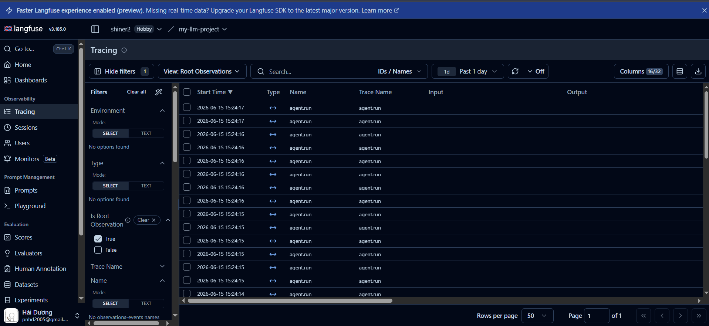
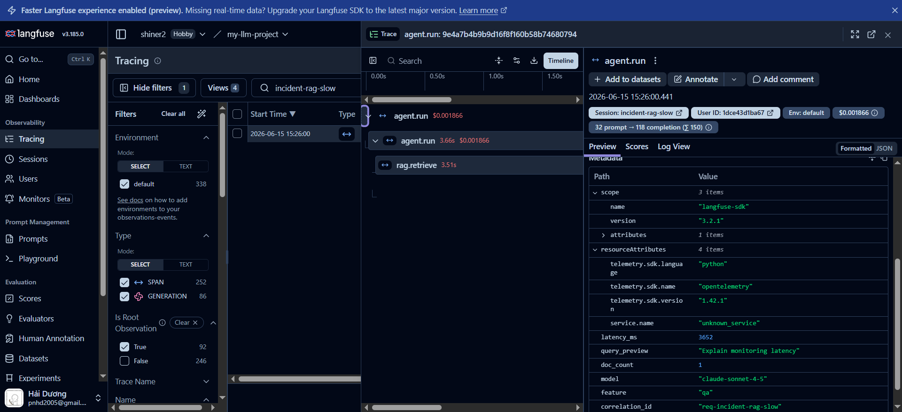
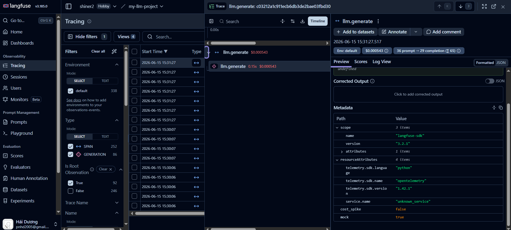

# Day 13 Observability Lab Report

> **Instruction**: Fill in all sections below. This report is designed to be parsed by an automated grading assistant. Ensure all tags (e.g., `[GROUP_NAME]`) are preserved.

## 1. Team Metadata

- [GROUP_NAME]: Day 13 Observability Lab - 2A202600629 Pham Ngoc Hai Duong
- [REPO_URL]: https://github.com/Shiner-2/2A202600629-PhamNgocHaiDuong-Day13
- [MEMBERS]:
  - Member A: Pham Ngoc Hai Duong

---

## 2. Group Performance (Auto-Verified)

- [VALIDATE_LOGS_FINAL_SCORE]: 100/100
- [TOTAL_TRACES_COUNT]: 16
- [PII_LEAKS_FOUND]: 0

---

## 3. Technical Evidence (Group)

### 3.1 Logging & Tracing

- [EVIDENCE_LANGFUSE_TRACE_LIST]: [15+ live traces](../evidence/langfuse_trace_list.png)
- [EVIDENCE_TRACE_WATERFALL_SCREENSHOT]: [Incident trace waterfall](../evidence/trace_waterfall.png)
- [EVIDENCE_TOKEN_COST_SCREENSHOT]: [LLM generation token and cost details](../evidence/langfuse_token_cost.png)
- [TRACE_WATERFALL_EXPLANATION]: Langfuse trace `32591d8f2fdf27f89dc856b06c07e854` contains the parent `agent.run` span, child `rag.retrieve` span, and `llm.generate` generation. The generation records token usage and cost. Input/output capture is disabled to prevent raw prompts and responses from leaking PII; the trace stores only sanitized metadata and the correlation ID.

#### Langfuse Trace List

#### Incident Trace Waterfall

#### Token and Cost Detail

### 3.2 Dashboard & SLOs

- [SLO_TABLE]:

| SLI | Target | Window | Current Value |
|---|---:|---|---:|
| Latency P95 | < 3000ms | 28d | 152ms |
| Error Rate | < 2% | 28d | 0% |
| Cost Budget | < $2.5/day | 1d | $0.0079 |
| Quality Score | > 0.75 | 1d | 0.8667 |
| Token Usage | < 1M/day | 1d | 985 |
| PII Leak Rate | 0% | 28d | 0% |

### 3.3 Alerts & Runbook

- [SAMPLE_RUNBOOK_LINK]: [High latency P95 runbook](alerts.md#1-high-latency-p95)

---

## 4. Incident Response (Group)

- [SCENARIO_NAME]: rag_slow
- [SYMPTOMS_OBSERVED]: `/chat` latency increased from a 153ms baseline P95 to 3.664s, breaching the 3-second latency SLO.
- [ROOT_CAUSE_PROVED_BY]: Langfuse trace `9e4a7b4b9b9d16f8f160b58b74680794` shows `rag.retrieve` taking 3.510s while `llm.generate` takes 0.151s.
- [FIX_ACTION]: Disabled the `rag_slow` toggle through `/incidents/rag_slow/disable`; subsequent requests return to the normal mock latency.
- [PREVENTIVE_MEASURE]: Configured the P95 alert at `latency_p95_ms > 3000 for 5m`, with a runbook that compares RAG and LLM spans.

---

## 5. Individual Contributions & Evidence

### Pham Ngoc Hai Duong (All Roles)

- [TASKS_COMPLETED]:

  - Logging & PII: Implemented correlation ID middleware, enabled PII scrubber for email/phone/CCCD/credit_card/passport patterns
  - Tracing & Enrichment: Fixed langfuse import to work with v3.2.1 API, bound user_id_hash/session_id/feature/model/env to all requests
  - SLO & Alerts: Configured four SLO targets and alert rules for latency, error rate, and cost budget
  - Load Test & Dashboard: Generated 15 baseline traces plus one incident trace, added a live six-panel dashboard, and verified metrics collection
  - Demo & Report: Completed blueprint report, validated logging output, confirmed 100/100 test score
- [EVIDENCE_LINK]:

  - Commit `1b5f871` (`feat: finish observability lab with live Langfuse evidence`)
  - app/middleware.py (Correlation ID implementation)
  - app/logging_config.py (PII scrubbing enabled)
  - app/main.py (Request enrichment with contextvars)
  - app/tracing.py (Langfuse API integration)
  - app/pii.py (Extended PII patterns)
  - evidence/runtime-verification.json (Langfuse trace IDs and measured metrics)

---

## 6. Bonus Items (Optional)

- [BONUS_COST_OPTIMIZATION]: Implemented token usage and cost tracking; the verified 15-request run used 572 input tokens and 413 output tokens for a total estimated cost of $0.0079.
- [BONUS_AUDIT_LOGS]: Not claimed; structured application logs contain correlation IDs, but a separate audit-log sink is not implemented.
- [BONUS_CUSTOM_METRIC]: Added quality_score metric (heuristic: presence of docs + answer length + term matching); tracks model output quality independent of latency
